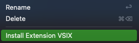

# GOPRINT

## Features

Easily insert Go `fmt.Println` statements.

For example:
`fmt.Println("example: ", example)`

<!--  -->

## Installing

### Build and install locally

- `npm install`

- #### Install The Visual Studio Code Extension Manager

  - `npm install -g vsce`

- #### Build using Extension Manager

  - `vsce package`

- #### Install .VSIX Extension File `goprint-0.0.1.vsix`

  - right-click `goprint-0.0.1.vsix` from inside VS Code to install
  - 
- OR
  - move `goprint-0.0.1.vsix` into your vscode extensions folder

### Download from Visual Studio Code Marketplace

This extension is available for free in the [Visual Studio Code Marketplace](https://marketplace.visualstudio.com/items?itemName=kflan-io.goprint)

## Usage

With selection:

- Highlight a variable (or any text really)
<!-- markdownlint-disable MD033 -->
- Press `Cmd+Shift+I` <kbd>⌘⇧I</kbd> (`Ctrl+Shift+I` on Windows)
- The output (on a new line) will be: `fmt.Println('variable: ', variable)`

Without selection:

- Press `Cmd+Shift+I`
- The output (on the same line) will be: `fmt.Println()`

## License

[MIT License](LICENSE)

-----------------------------------------------------------------------------------------------------------

**Enjoy!**
